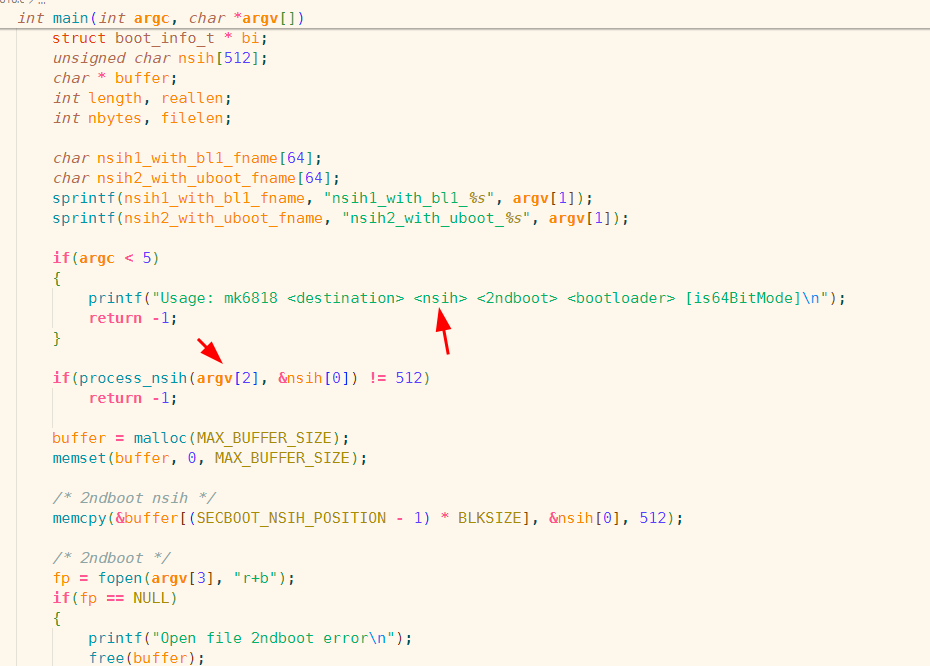
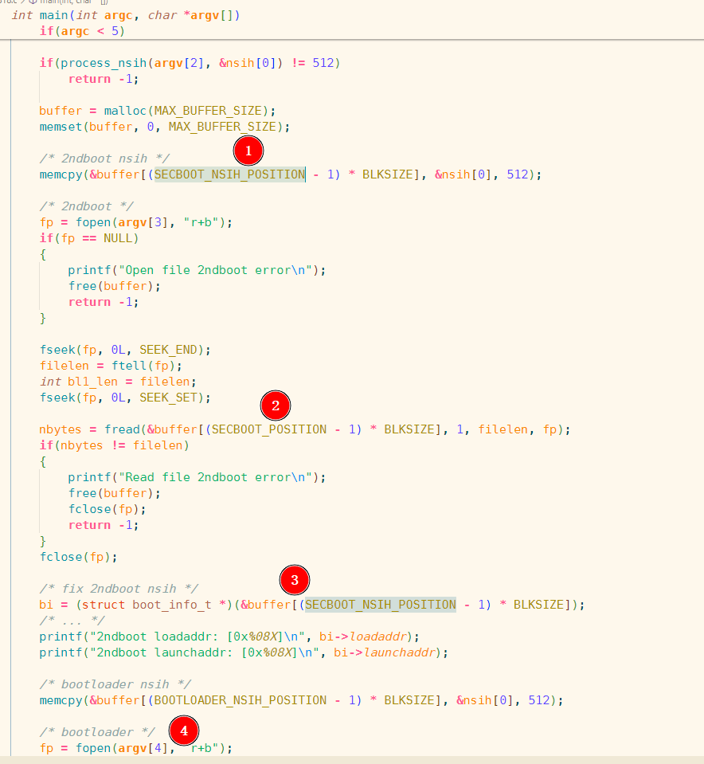
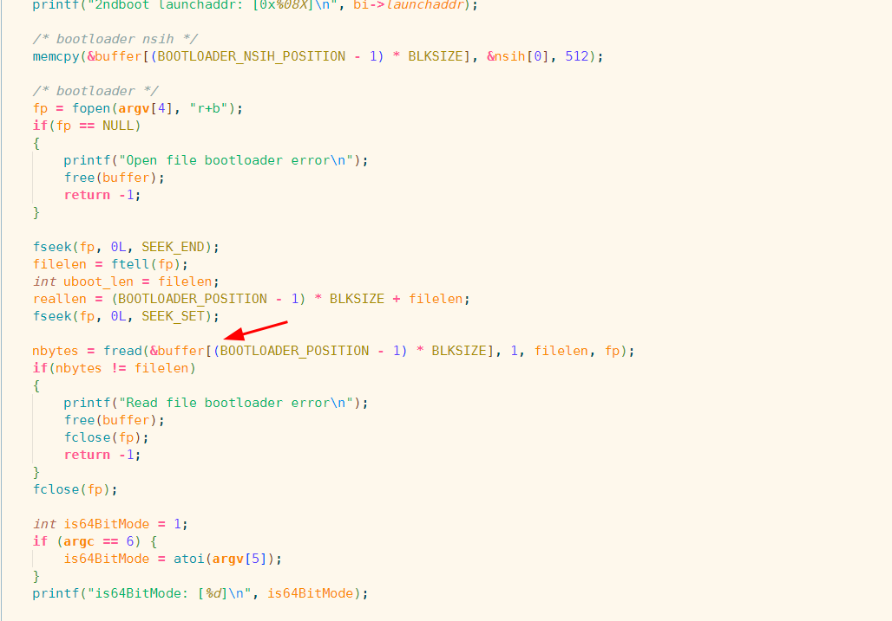
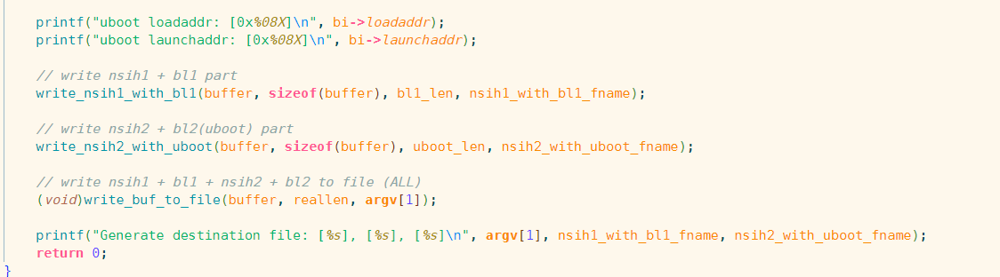

## mk6818

mk6818可以组合NSIH1，bl1，NSIH2，uboot成为一个可启动文件

&nbsp;

**使用方法：**

Usage: mk6818 \<destination\> \<nsih\> \<2ndboot\> \<bootloader\> \[is64BitMode\]

destion：目标启动文件名字

nsih：nsih1，2使用的txt文件，参考自带的drone-sd-64.txt，32位可以参考bl1-gec6818/reference-nsih

2ndboot：bl1编译出来的二进制文件

bootloader：uboot编译出来的u-boot.bin文件，不要使用fip-nonsecure.img，这个已经组合了nsih，且为安全启动添加了ca

is64BitMode：0：32位模式；1：64位模式，可选参数，很重要，决定了nsih2中的loadaddr和startaddr&nbsp;

&nbsp;

**s5p6818启动流程：**

1. 上电后芯片内部bootrom启动，按外围配置电阻进行不同模式的启动，GEC6818使用了默认的配置，先启动SD卡0，启动失败再启动EMMC，EMMC启动失败进入USB下载模式，使用USB过来的NSIH和bl1进行启动。
2. SD和EMMC启动逻辑基本一致，先不考虑文件系统，直接读取SD卡的第1个扇区（跳过0，0里面包含分区表）也就是前面提及的NSIH1，NSIH1一共512字节，占一个扇区，最后以魔术数NSIH结尾，从NSIH1中获取的信息比较多，最核心的包含复位vector代码，bootrom后面会跳到这里执行；再是启动设备配置，包括从sd多少个字节开始读取（Device Read Address from 2ndboot Device.），读取多长（Load Size for 2ndboot.），读取后加载到内存的哪里（Load Address for 2ndboot.），2nd后启动的设备（Boot From）；然后再是时钟PLL配置，设置核心频率；再是内存DDR设置，用于初始化DDR。
3. 对于NSIH1部分，bootrom固定读取1扇区到62扇区的数据为2ndboot（有时也叫bl1），总共30kb左右，这时ddr还没有初始化，代码数据全部load到ocram中，跳转到vector执行部分初始化代码，vector代码跳转到bl1的地址执行bl1；实际上NSIH1的deviceaddr和loadsize用途并不大，loadaddr和launchaddr指向0xffff0000还是有意义的。
4. bl1代码执行，可以设置比较多东西，主要继续设置时钟源，设置电源管理芯片，最重要的是设置DDR控制器，初始化DDR；这些步骤完成后，bl1内部根据nsih2的位置（来源于nsih1的Device Read Address from 2ndboot Device，这里容易混淆），读取nsih2，之后从nsih2中的deviceaddr读取loadsize个字节，到loadaddr，最后跳转到launchaddr执行代码。nsih2中的vector是个坑，然后nsih2中的ddr，pll，这些配置实际我们用不到，但是还是要按这样格式来，不然bl1不会认。

&nbsp;

**代码解析：**
&nbsp;
```c
#define BLKSIZE						(512)

#define SECBOOT_NSIH_POSITION		(1)
#define SECBOOT_POSITION			(2)
#define BOOTLOADER_NSIH_POSITION	(64)
#define BOOTLOADER_POSITION			(65)

#define MAX_BUFFER_SIZE				(32 * 1024 * 1024)
```

首先定义的这个宏里面，描述了几个重要数据结构的位置，块大小为512字节，nsih1（代码叫做SECBOOT_NSIH）的位置是1扇区，bl1的位置从2扇区开始，到63扇区为止，64扇区为nsih2，65扇区开始为uboot的代码；我们的目标就是构造一片内存，模拟出上面的场景，写入对应数据，最后写成文件。



main函数第一步，处理nsih的txt文件，以为不可能使用纯文本，基本是把前面的一串十六进制从字符串，写成byte array，忽略\\\注释后面的内容。详情阅读代码



1. 复制nsih1到模拟内存对应位置（1扇区）
2. 读取bl1到内存对应位置（2扇区开始）
3. 没有干实际用途，仅打印nsih1里面的loadaddr和launchaddr，便于调试
4. 复制nsih2到模拟内存位置（63扇区），注意数据还是用的同一个nsih（nsih[0]，从txt中解析出来的），我们只需要修改下地址，其他一致就行



读取uboot到模拟内存指定位置，然后根据是32位还是64位，设置nsih2中的loadaddr和launchaddr

```c
    /* fix bootloader nsih */

    bi=(structboot_info_t*)(&buffer[(BOOTLOADER_NSIH_POSITION-1)*BLKSIZE]);

    bi->deviceaddr=0x00008000;

    bi->loadsize=((filelen+512+512)>>9)<<9;

    if(is64BitMode>0){

        /* once cpu run in aarch64 mode, you can not jump to reset vector address anymore

        will cause a ARM exception

        the first instruction will no longer be 'MOV PC, ResetV'

        we need to jump to the first address of u-boot */

        bi->loadaddr=0x43bffe00;

        bi->launchaddr=0x43C00000;

    }else{

        /* in arrch32 mode, this won't be a issue, jump to start of vector

        and it will jump to startaddr of u-boot by set the value of pc */

        bi->loadaddr=0x43C00000;

        bi->launchaddr=0x43C00000;

    }
```

对于32位，从新执行一遍vector里面的代码，再跳转到uboot也无所谓，对于64位模式，nsih1到bl1代码中，已经完成了arm模式的切换，再执行这个操作会fault

所以64位的launchaddr要多loadaddr 512个字节，直接执行uboot的代码，其实32位这样理论也行



最后我们写3个文件，用于不同用途调试：

1. 带nsih1的bl1，用于调试bl1使用
2. 带nsih2的uboot，用于bl1启动usb下载模式后，使用nanopi-load加载启动使用
3. 完整体，nsih1+bl1+nsih2+uboot，用于烧录到sd卡或者emmc中，用于启动uboot，然后启动操作系统
